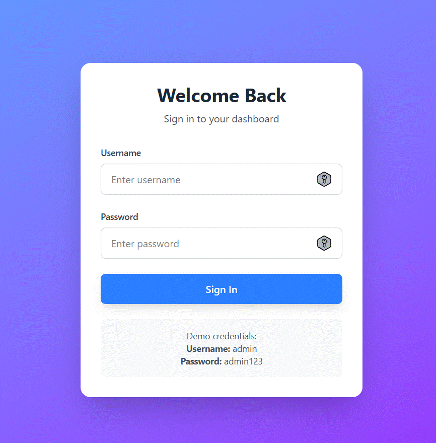
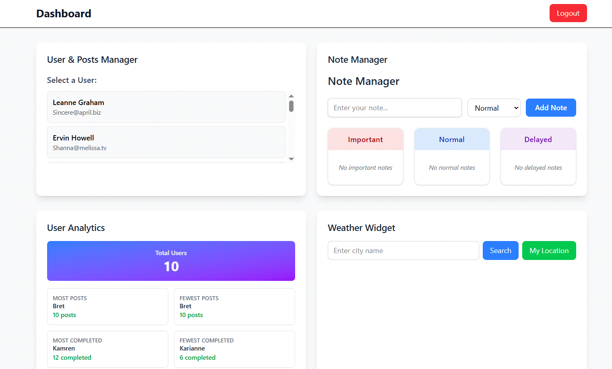

# React Dashboard Application

A modern, feature-rich dashboard application built with React, TypeScript, and Tailwind CSS. This project demonstrates state management, API integration, routing, and real-time data fetching with a clean, responsive UI.

## 🚀 Features

### 🔐 Authentication

*Secure login interface with demo credentials (Username: admin, Password: admin123)*

- Secure login system with protected routes
- Session persistence using localStorage
- Demo credentials for easy testing (Username: `admin`, Password: `admin123`)
- Automatic redirect based on authentication status

### 📊 Dashboard Overview

*Main dashboard displaying all four interactive feature cards*

The dashboard contains four powerful components:

#### 1. **User & Posts Manager**
- Fetch and display users from JSONPlaceholder API
- View detailed user information
- Display user's posts and todos
- Interactive todo completion toggle with state persistence
- Real-time data fetching with React Query

#### 2. **Note Manager**
- Create notes with priority levels (Important, Normal, Delayed)
- Organize notes by priority in separate columns
- Change note priority with dropdown selection
- Delete notes
- Persistent storage using localStorage
- Color-coded priority system

#### 3. **Simple Analytics**
- Display total number of users
- Show statistics:
  - User with most/fewest posts
  - User with most/fewest completed todos
- Clean, card-based layout for easy reading

#### 4. **Weather Widget**
- Real-time weather data from OpenWeatherMap API
- Search weather by city name
- Auto-detect current location weather
- Display temperature, humidity, weather description, and icon
- Loading and error states

## 🛠️ Tech Stack

### Core
- **React 19.1.1** - UI library
- **TypeScript 5.9.3** - Type safety
- **Vite 7.1.14** - Build tool and dev server

### Styling
- **Tailwind CSS 4.1.16** - Utility-first CSS framework
- **@tailwindcss/vite** - Vite plugin for Tailwind

### State Management & Data Fetching
- **React Query (TanStack Query) 5.90.5** - Async state management
- **React Router DOM 7.9.4** - Client-side routing
- **Context API** - Authentication state

### Development Tools
- **ESLint 9.38.0** - Code linting
- **TypeScript ESLint 8.46.2** - TypeScript linting
- **@vitejs/plugin-react-swc 4.2.0** - Fast React refresh

## 📋 Prerequisites

- Node.js >= 20.19.0 or >= 22.12.0
- npm or yarn package manager

## 🔧 Installation

1. **Clone the repository**
```bash
git clone <repository-url>
cd react-dashboard
```

2. **Install dependencies**
```bash
npm install
```

3. **Set up environment variables**

Create a `.env` file in the root directory:
```env
VITE_OPENWEATHER_API_KEY=your_api_key_here
```

Get your free API key from [OpenWeatherMap](https://openweathermap.org/api)

> **Note:** The current implementation has the API key hardcoded for demo purposes. For production, use environment variables.

4. **Start the development server**
```bash
npm run dev
```

The application will be available at `http://localhost:5173`

## 📦 Available Scripts

```bash
# Start development server
npm run dev

# Build for production
npm run build

# Preview production build
npm run preview

# Run ESLint
npm run lint
```

## 🎯 Usage

### Login
Use the demo credentials to access the dashboard:
- **Username:** `admin`
- **Password:** `admin123`

### Dashboard Navigation
After successful login, you'll be redirected to the dashboard where you can:
- Select users to view their posts and todos
- Create and manage notes with different priorities
- View user analytics and statistics
- Check weather for any city or your current location

## 📁 Project Structure

```
react-dashboard/
├── public/              # Static assets
├── src/
│   ├── components/      # React components
│   │   ├── Login.tsx
│   │   ├── Dashboard.tsx
│   │   ├── UserPostsManager.tsx
│   │   ├── NoteManager.tsx
│   │   ├── SimpleAnalytics.tsx
│   │   └── WeatherWidget.tsx
│   ├── context/         # Context providers
│   │   └── AuthContext.tsx
│   ├── types/           # TypeScript type definitions
│   │   └── index.ts
│   ├── App.tsx          # Main app component with routing
│   ├── main.tsx         # Application entry point
│   └── index.css        # Global styles
├── index.html
├── package.json
├── tsconfig.json
├── vite.config.ts
└── README.md
```

## 🔑 Key Features Implementation

### Authentication Flow
- Context API for global auth state
- Protected routes with React Router
- Automatic redirect based on authentication status
- Persistent login using localStorage

### Data Fetching Strategy
- React Query for efficient data fetching and caching
- Automatic refetching and background updates
- Loading and error states
- Optimistic updates for better UX

### State Management
- React Query for server state
- Context API for authentication
- Local state with useState for UI components
- localStorage for data persistence (notes, login status, todos)

## 🌐 API Endpoints Used

### JSONPlaceholder (Free fake API)
- Users: `https://jsonplaceholder.typicode.com/users`
- Posts: `https://jsonplaceholder.typicode.com/posts`
- Todos: `https://jsonplaceholder.typicode.com/todos`

### OpenWeatherMap
- Current Weather: `https://api.openweathermap.org/data/2.5/weather`
- Weather Icons: `https://openweathermap.org/img/wn/[icon]@2x.png`

## 🎨 Styling Approach

- **Tailwind CSS** for utility-first styling
- Responsive design with mobile-first approach
- Color-coded priority system for notes
- Consistent spacing and typography
- Loading states and error messages
- Smooth transitions and hover effects

## 🔒 Security Considerations

⚠️ **Important for Production:**
- Move API keys to environment variables
- Implement proper backend authentication
- Use HTTPS for all API calls
- Add rate limiting for API requests
- Implement proper error handling
- Add input validation and sanitization

## 🚧 Future Enhancements

- [ ] Real backend authentication with JWT
- [ ] User registration and password reset
- [ ] Dark mode toggle
- [ ] More detailed analytics with charts
- [ ] Export functionality for notes and analytics
- [ ] Real-time notifications
- [ ] Multiple dashboard themes
- [ ] User profile management
- [ ] Advanced filtering and search
- [ ] Data export to CSV/PDF

## 🐛 Known Issues

- Weather API key is hardcoded (should be in env variables for production)
- No backend validation for login credentials
- Limited error handling for network failures
- Todo completion state only persists in local component state

## 📄 License

This project is open source and available under the [MIT License](LICENSE).

## 🤝 Contributing

Contributions, issues, and feature requests are welcome! Feel free to check the issues page.

## 📧 Contact

For questions or feedback, please open an issue in the repository.

---

**Built with ❤️ using React, TypeScript, and Tailwind CSS**